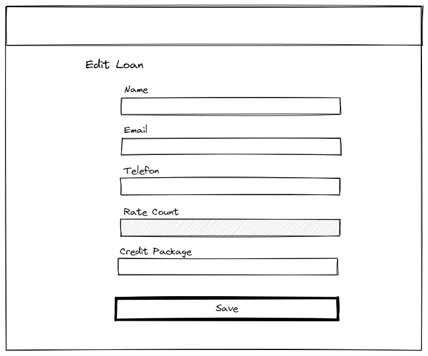
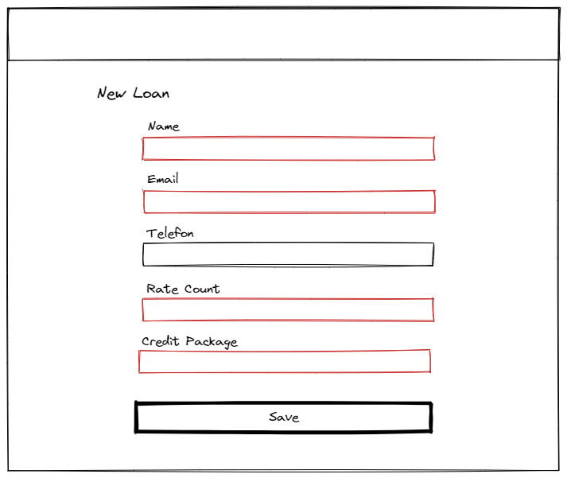

# Formulare

In diesem Abschnitt finden Sie Wireframes, welche als Entwürfe der umgesetzten Formulare dienen. Sie visualisieren mutierbare und nicht mutierbare Felder, beziehungsweise erforderliche und nicht erforderliche Felder, sowie gültige und ungültige Eingaben.

## Edit Loan

Die untenstehende Grafik ist ein Wireframe für das Formular zur Bearbeitung einer Kreditverleihe. Das ausgegraute "Rate Count" Feld ist in diesem Formular nicht bearbeitbar. Der "Rate Count" kann nur beim erstellen eines Kreditverleihs gesetzt werden und ist nicht mutierbar.

## New Loan

Die untenstehende Grafik ist ein Wireframe für das Formular zur Erstellung einer Kreditverleihe. Die rot markierten Felder sind erforderlich. Das Feld "Telefon" ist optional.

