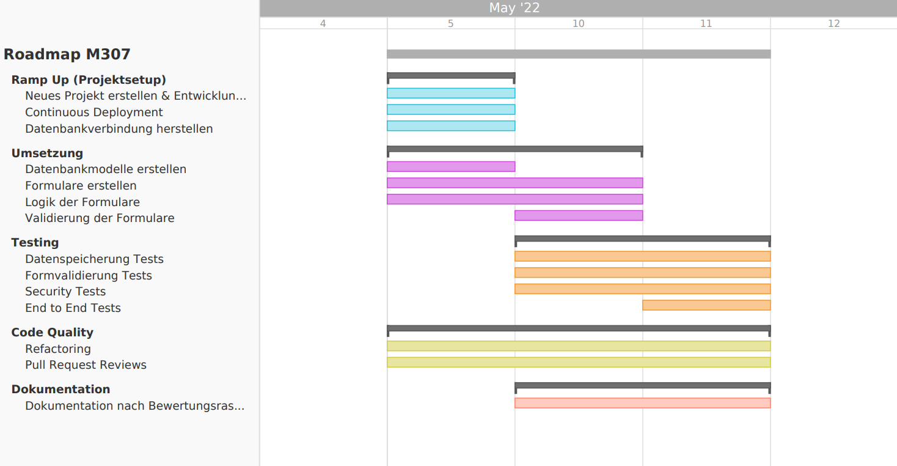

# Roadmap

Das untenstehende Gantt Diagramm visualisiert unsere Arbeitseinteilung über die drei Tage, an denen wir an unserem Projekt gearbeitet haben. Es ist zu beachten, dass dieses Diagramm keine User Stories und deren Roadmap enthält, sondern ausschliesslich grössere Aufgabenblöcke. 

